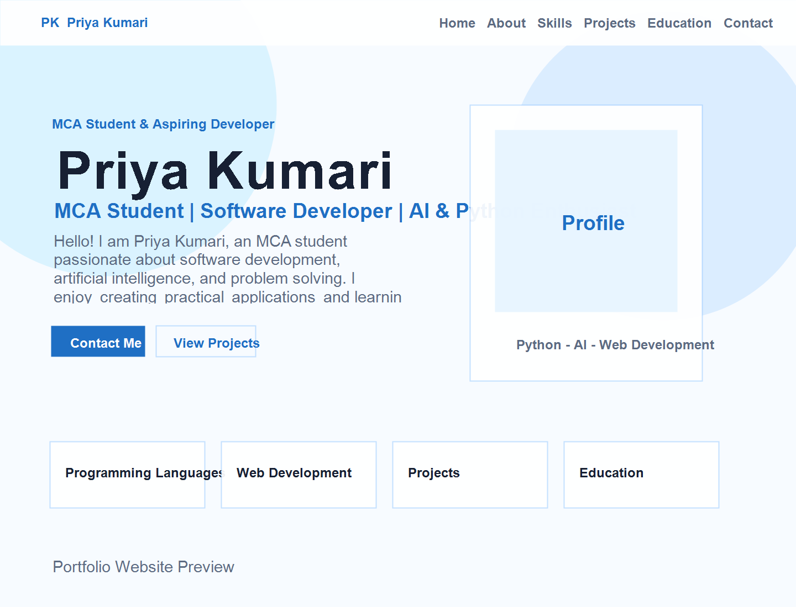

# 🌐 Priya Kumari Portfolio Website

A modern, elegant, and fully responsive personal portfolio website for **Priya Kumari**, an MCA student and aspiring Software Developer passionate about **Python, Artificial Intelligence, Web Development, and Software Engineering**.

---

## 📸 Screenshot

<p align="center">
  
</p>

---

## ✨ Features

- 🎨 Modern white & light blue UI
- 📱 Fully responsive design (Mobile, Tablet & Desktop)
- ⚡ Smooth scrolling navigation
- ✨ Scroll reveal animations
- 🪟 Interactive project cards with modal popup
- 🧊 Glassmorphism design elements
- 👩 Hero section with portfolio highlights
- 💻 Skills section
- 🚀 Projects showcase
- 🎓 Education timeline
- 🏆 Achievements section
- 📩 Contact form
- 🔍 SEO-friendly HTML structure
- ⚙️ Clean and maintainable code

---

## 📂 Sections

- Home
- About
- Skills
- Projects
- Education
- Achievements
- Contact

---

## 🛠️ Tech Stack

- HTML5
- CSS3
- JavaScript
- Google Fonts
- Font Awesome

---

## 📁 Project Structure

```text
Priya-Portfolio/
│
├── assets/
│   └── portfolio-screenshot.png
│
├── index.html
├── styles.css
├── script.js
└── README.md
```

---

## 🚀 Getting Started

### 1. Clone the repository

```bash
git clone https://github.com/your-username/priya-portfolio.git
```

### 2. Navigate to the project folder

```bash
cd priya-portfolio
```

### 3. Open the project

Simply open **index.html** in your preferred web browser.

No additional installation or dependencies are required.

---

## 💼 Portfolio Highlights

- Responsive Portfolio Design
- Modern UI/UX
- Clean Code Architecture
- Project Showcase
- Skills Visualization
- Education Timeline
- Contact Section
- Interactive Animations

---

## 👩‍💻 Author

**Priya Kumari**

**MCA Student**  
**Software Developer**  
**Python | AI | Web Development Enthusiast**

---

## 📄 License

This project is created for educational and portfolio purposes.

---

## © Copyright

**© 2026 Priya Kumari. All Rights Reserved.**
